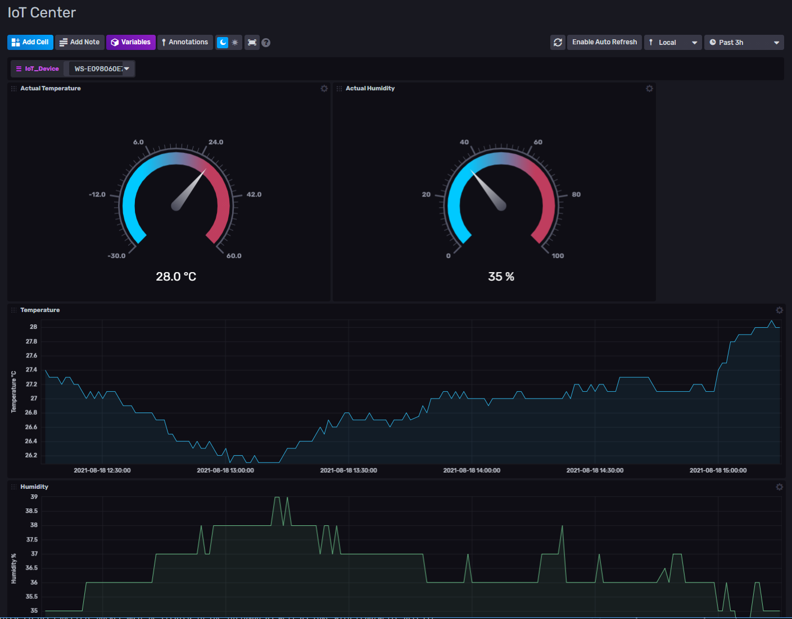

# Weather Station

## Description

Weather station is a smart IoT device that shows various information on the embedded OLED display.

It can show the following information:

- Actual `time and date` (in analog and digital format). Accurate time and date is automatically loaded from NTP time service.
- Current `temperature` and `humidity` using internal sensor
- `Temperature chart` showing trend for the last 90 minutes. If the temperature is stored into InfluxDB, after rebooting this temperature history is fully loaded back from the InfluxDB.
- `Current weather` - shows weather icon, temperature, and wind speed. It automatically identifies approximate location for weather service based on assigned IP address. The weather is updated once per hour.
- `Weather forecast` for the next three days at noon - shows weather icon, temperature, wind speed and wind direction
- `Moon phase`, moon set/rise and sun set/rise time

To get time, location, weather forecasts and other information, the weather station requires Internet connection over WiFi. The temperature and humidity from the internal sensor can be also automatically stored into InfluxDB to analyze history.
Information on the OLED display can be localized. Currently we support English and Czech language. The weather station firmware is checked once per day and in case of new firmware, it is automatically updated from the centralized repository.
The weather station is powered via USB cable.

## QuickStart Guide

### WiFi Connection

Weather station requires WiFi network (to get time/date, weather forecast, to store temperature/humidity history, etc.)
Because it does not have any keyboard to configure it, the Weather Station requires your mobile phone or computer to set it up. It creates own WiFi hotspot to connect it by your device.

WiFi Configuration steps:

1) Plug USB cable into the Weather Station to power on. If your computer shows missing driver message, you can ignore it.
2) The Weather Station shows a name of WiFi network for configuration that is created by the Weather Station itself. If you see Connecting WiFi message, and the Weather Station is unable to connect, please wait for 30 seconds to show the WIFi network.
3) Connect your phone or laptop to this WiFi. No password is required.
4) If the phone or laptop shows that the WiFi does not offer Internet connection, please ignore it and confirm the connection - the WiFi was created just for configuration of the Weather Station
5) A configuration page should be displayed automatically. If not, open your browser and type <http://1.1.1.1> In both cases you should see Weather Station web page.
6) Select your home/company WiFi network from the list that Weather Station can connect. The list is sorted from the strongest one. If your WiFi network is hidden, please enter the name (SSID) manually via link. Note that only 2.4GHz WiFi networks are supported.
7) Enter your WiFi network password, if exists
8) Click to Save button
9) The Weather Station should reboot and sync all the data via the newly configured WiFi. Your phone or laptop should be disconnected automatically.
10) If you see again the same message on the OLED display as in the second step, the network name or password has been entered incorrectly. Please repeat the process.

### InfluxDB Configuration

If you want to record your temperature and humidity measured by the Weather Station sensor, you need to setup an InfluxDB account.
You can also use a free [InfluxDB Cloud](https://cloud2.influxdata.com) account, or you can deploy your own InfluxDB instance. Additionally, the Weather Station also records into InfluxDB some run-time measurements like free memory, heap fragmentation, reboot reason, firmware version or uptime.
The following steps require a Weather Station with properly connected WiFi network (see the previous chapter).

InfluxDB Configuration steps:

1) Wait for the last page on the OLED display
2) Enter into the web browser on your phone or computer the address from the last page
3) Your browser should show Weather Station web page. Note that your phone or computer must be connected to the same WiFi network as the Weather station otherwise you cannot open it.
4) Select InfluxDB Settings from the menu
5) Fill all required fields (specific bucket must be created in the InfluxDB as well as token with read/write access)
6) Click to Save button
7) If you see an exclamation mark icon in the top left corner of the OLED display, the fields are not entered correctly, or Weather Station lost the connection to the InfluxDB.

## Technical part

### Hardware

Developed for Weather Station DIY kit that consists of:

- `IoT Platform` - [ESP8266](https://docs.ai-thinker.com/_media/esp8266/docs/esp-12f_product_specification_en.pdf)
- `Display` - OLED 0,96" 128x64 [SSD1306](https://cdn-shop.adafruit.com/datasheets/SSD1306.pdf)
- `Temperature and Humidity sensor` - [DHT11](https://www.mouser.com/datasheet/2/758/DHT11-Technical-Data-Sheet-Translated-Version-1143054.pdf)

### Source Code

The Weather Station project consists of three sub-projects:

1) [Full Arduino Implementation](arduino/WeatherStation#weather-station)
2) [Basic Micropython Implementation](micropython)
3) [Case for 3D Printer](case)
