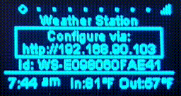

# Weather Station

Weather station with OLED and WiFi (using ESP8266, SSD1306, and DHT11) with InfluxDB support

## Arduino IDE

* Into "File/Preferences/Additional Boards Manager URLs:" add "http://arduino.esp8266.com/stable/package_esp8266com_index.json"
* Menu Tools/Board:/Boards Manager select esp8266 and Install it
* Select Tools/Board: NodeMCU 1.0 (ESP-12E Module)
* Connect weather station via USB
* Select Tools/Port: the serial port created by the weather station
* Open WeatherStation.ino file
* Update OPEN_WEATHER_MAP_API_KEY
* Click the secon icon in the toolbar "Upload"

* Create iot_center bucket inside InfluxDB

## Required Libraries

(accessible via Library manager - indented libraries installed as dependencies)

* ESP8266 and ESP32 OLED driver for SSD1306 displays (by ThingPulse, Fabrice Weinberg)
* ESP8266 Weather Station (by ThingPulse) optimized version from https://github.com/bonitoo-io/esp8266-weather-station
  * Json Streaming Parser (by Daniel Eichhorn)
* DHT sensor library (by Adafruit)
  * Adafruit Unified Sensor (by Adafruit)
* ESP8266 Influxdb (by Tobias Schürg, InfluxData)
* ESP Github Updater - from https://github.com/vlastahajek/ESP-Github-Updater
